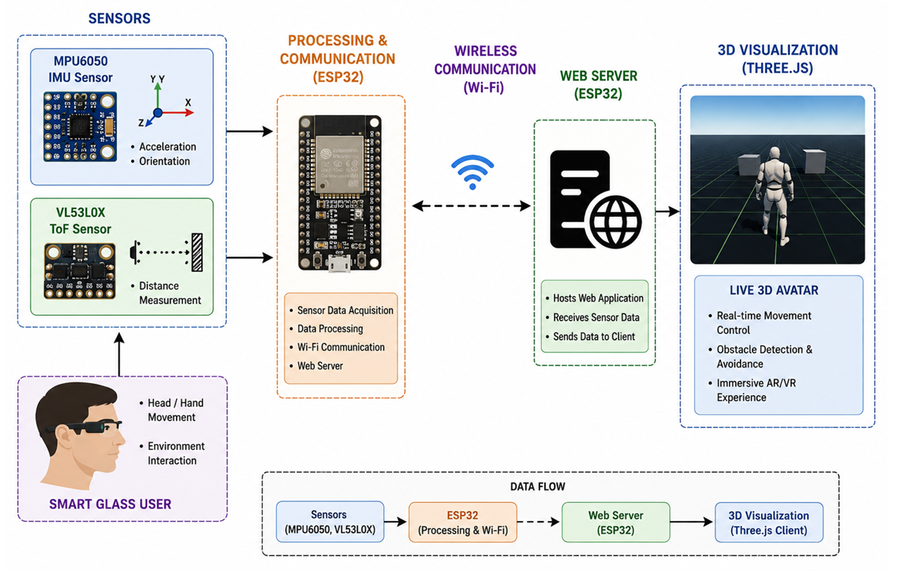
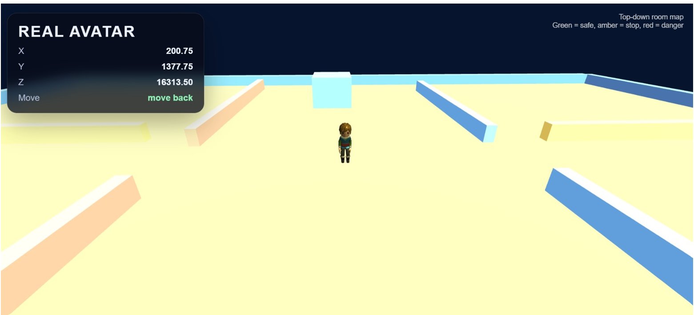
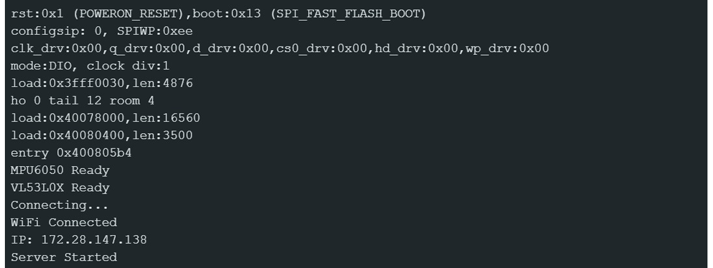

# VR-Navigation-system
#  IoT-Based Real-Time 3D Avatar Navigation using ESP32, MPU6050 & Three.js

##  Project Overview

This project demonstrates a **real-time 3D avatar navigation system** that combines **IoT hardware** with **3D web visualization**. The system uses an **ESP32**, **MPU6050 Motion Sensor**, and **VL53L0X Time-of-Flight (ToF) Sensor** to capture real-world movements and control a virtual 3D avatar inside a browser using **Three.js**.

The project showcases how physical sensor movements can be translated into real-time avatar navigation, making it suitable for applications in **AR/VR, robotics, smart navigation, human-computer interaction, and IoT systems**.

---

#  Features

-  Real-time motion tracking using MPU6050
-  Distance measurement using VL53L0X ToF Sensor
-  Wireless communication using ESP32 Wi-Fi
-  Live sensor data streaming through HTTP API
-  Interactive 3D avatar visualization using Three.js
-  Smooth avatar movement based on sensor orientation
-  Obstacle detection using ToF sensor
-  Lightweight and browser-based implementation
-  Easily extendable for AR/VR and robotics applications

---

#  Technologies Used

### Hardware
- ESP32 Development Board
- MPU6050 Accelerometer & Gyroscope
- VL53L0X Time-of-Flight Distance Sensor

### Software
- Arduino IDE
- HTML5
- JavaScript
- Three.js
- GLTF Loader
- WebGL
- ESP32 Web Server

---

#  System Architecture

```text
              MPU6050
                  │
                  │
          VL53L0X ToF Sensor
                  │
                  ▼
               ESP32
        (Sensor Processing)
                  │
             Wi-Fi Network
                  │
          HTTP JSON API (/data)
                  │
                  ▼
           Three.js Web App
                  │
                  ▼
        3D Avatar Visualization
```

---
<p align="center">

</p>

#  Working Principle

1. MPU6050 continuously captures the motion and orientation of the sensor.
2. VL53L0X measures the distance from nearby obstacles.
3. ESP32 processes the sensor readings and hosts a local web server.
4. Sensor values are transmitted wirelessly in JSON format.
5. The Three.js application fetches live sensor data.
6. The 3D avatar moves according to the sensor orientation.
7. Distance measurements are used for obstacle awareness.

---

# 📂 Project Structure

```text
Project/
│
├── ESP32_MPU6050_Web_Server.ino
├── index.html
├── avatar.glb
├── README.md
└── assets/
```

---

#  JSON Data Format

```json
{
  "x": -7328,
  "y": 6468,
  "z": 13596,
  "distance": 1100
}
```

---

#  How to Run

### 1. Upload ESP32 Code

- Open Arduino IDE
- Install ESP32 Board Package
- Install required libraries
- Upload `ESP32_MPU6050_Web_Server.ino`

### 2. Connect Hardware

- MPU6050 → ESP32 (I2C)
- VL53L0X → ESP32 (I2C)

### 3. Connect to Wi-Fi

Update your Wi-Fi credentials inside the Arduino code.

### 4. Note ESP32 IP Address

After uploading, open the Serial Monitor and copy the displayed IP address.

Example:

```
http://192.168.1.10/data
```

### 5. Update HTML

Replace the fetch URL inside `index.html` with your ESP32 IP address.

### 6. Start Local Server

```bash
python -m http.server 8000
```

Open

```
http://localhost:8000
```

The avatar will load and respond to live sensor movements.

---

#  Demonstration

### Motion Control

- Tilt Left → Avatar moves Left
- Tilt Right → Avatar moves Right
- Tilt Forward → Avatar moves Forward
- Tilt Backward → Avatar moves Backward

- 
<p align="center">

</p>

<p align="center">

</p>
### Distance Detection

The VL53L0X sensor continuously measures obstacle distance, enabling obstacle-aware movement.

---

#  Applications

- Human Motion Tracking
- AR/VR Interaction
- Robotics Navigation
- Smart Wearables
- Digital Twin Systems
- IoT-based Interactive Applications
- Educational Demonstrations
- Smart Glass Interfaces

---

# 🚀 Future Enhancements

- Full Body Skeleton Tracking
- Gesture Recognition
- Voice Commands
- Multi-user Avatar Interaction
- Cloud-Based Data Logging
- Unity Integration
- WebXR / VR Headset Support

---

#  Project Highlights

- Real-Time IoT Communication
- 3D Browser-Based Visualization
- Wireless Motion Tracking
- Lightweight Architecture
- Modular and Scalable Design
- Open-Source Technologies

---

#  Author

**Ananya Mavinakatti**

Bachelor of Engineering (Computer Science)

Passionate about IoT, AR/VR, AI, and Full-Stack Development.

---

# 📜 License

This project is intended for educational and research purposes.
